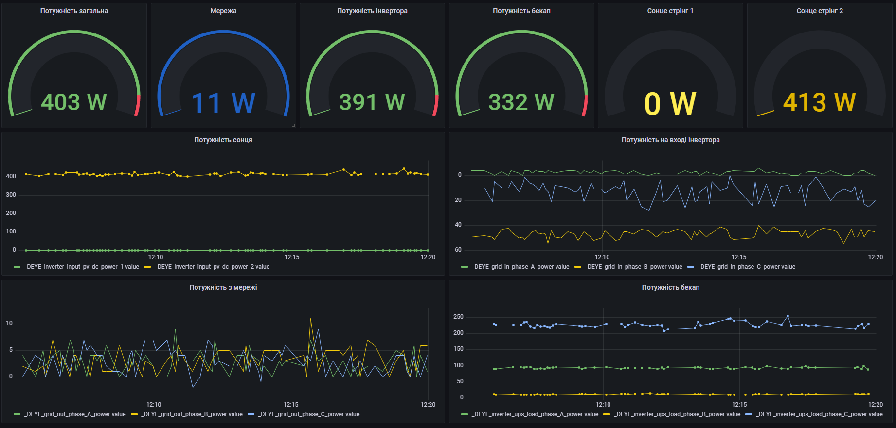

# deye-modbus2mqtt
Initialy created as bridge between DEYE inverter and MQTT broker

# Current features
- pull DEYE registers every 5 seconds
- push data to MQTT
- push data to InfluxDB

# TODO
- Implement reading data for more that 1 register (Hi/Low values)

# Grafana dashboard example

